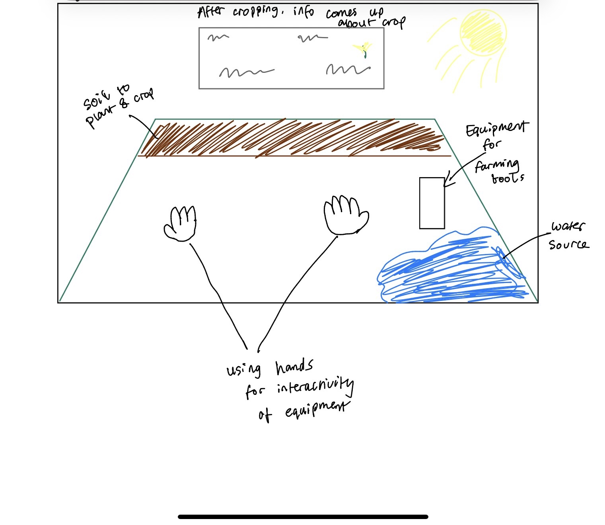

# XRP-Assignment
| **Name**     | **Student Number** |
| ----------- | ----------- |
| Karl Negrillo      | C22386123       |

# Title: Virtual Farm Planting XR

## Project Idea
This project is an interactive, **standalone** XR experience set on a virtual farm where users guide crops from seed to harvest. The user digs a plot in the soil, selects a seed, plants it, covers it up, and waters it using hand tracking interactions. The crop then grows rapidly via animation sequence. Once mature, the user harvests the crop and recieves educational informatiion about its nutritional and environmental benefits. The project is designed to be highly accessible and engaging, providing users with hands-on learning about sustainable food production.

## Which SDG(s) your project addresses and Why?
My project will experience and focus on SDG 2: Zero Hunger. The experience teaches sustainable agriculture by guiding users through planting, watering, growth, and harvesting, showing how efficient water use, crop choice, and soil care support reliable food supplies. Each stage in the planting process is linked to real-world agriculture principles, highlighting how smart farming and food choices can have a global impact. 

## Key Features and Interactions
These are the key features and interations that my assignment will have
- Immersive Farm Environment where users move through the crop-growing cycle step-by-step
- Digging soil, picking seeds, planting, covering, watering, and harvesting, all through simple and accessible XR gestures (Like picking up, tilting, etc)
- Animated, fast-forwarded plant growth and crop maturity to reinforce plant life cycles
- Educational popups/dashboards to provide facts after harvesting
- Spatial Audio for digging, watering, and environmental sounds

## XR Technologies Utilized
- Hand Tracking for all major interactions (dig, plant, water, harvest)
- 3D user interface for selecting seeds and displaying crop data
- Spatial audio feedback throughout the experience

## Sample Design for Assignment
