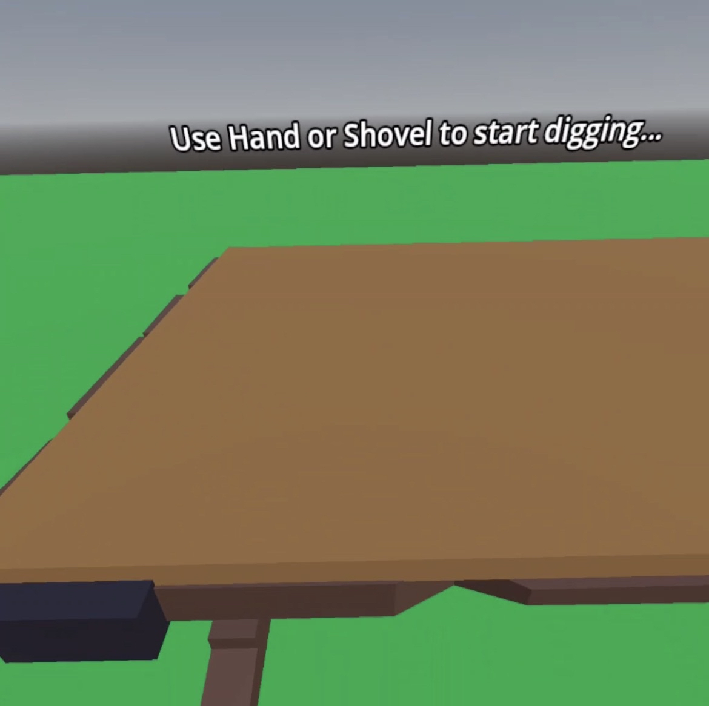
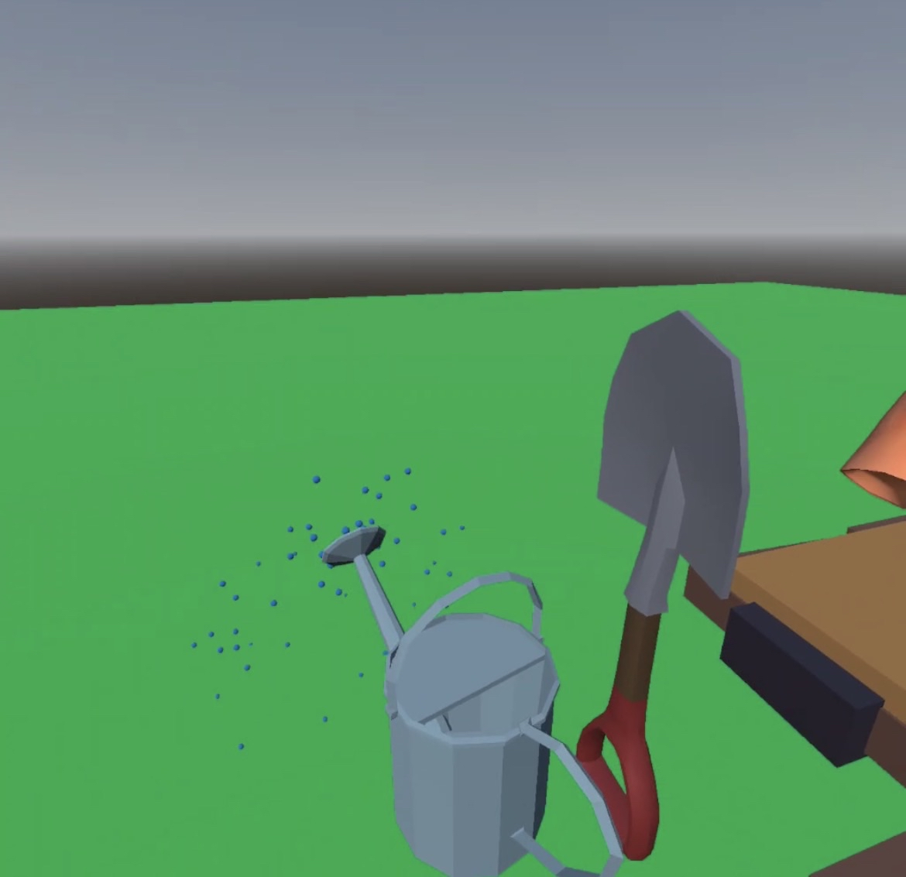
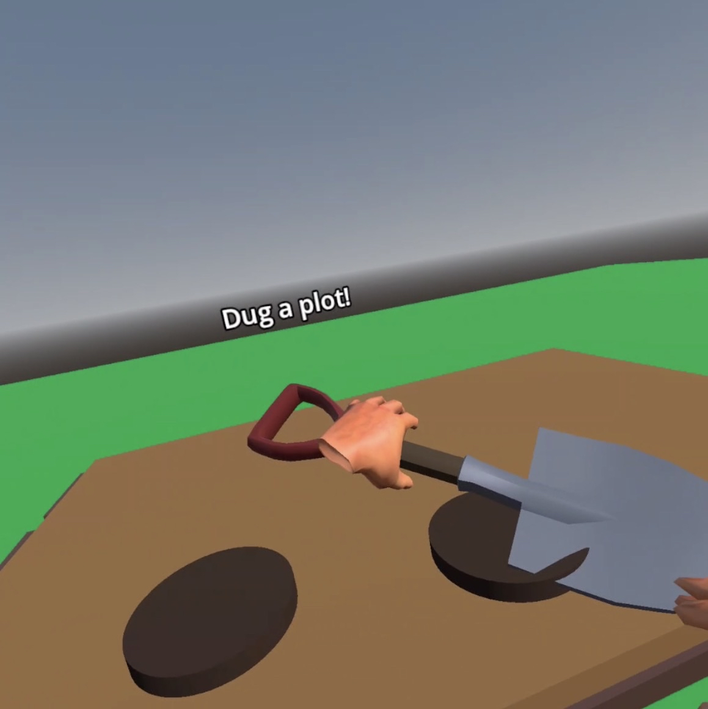
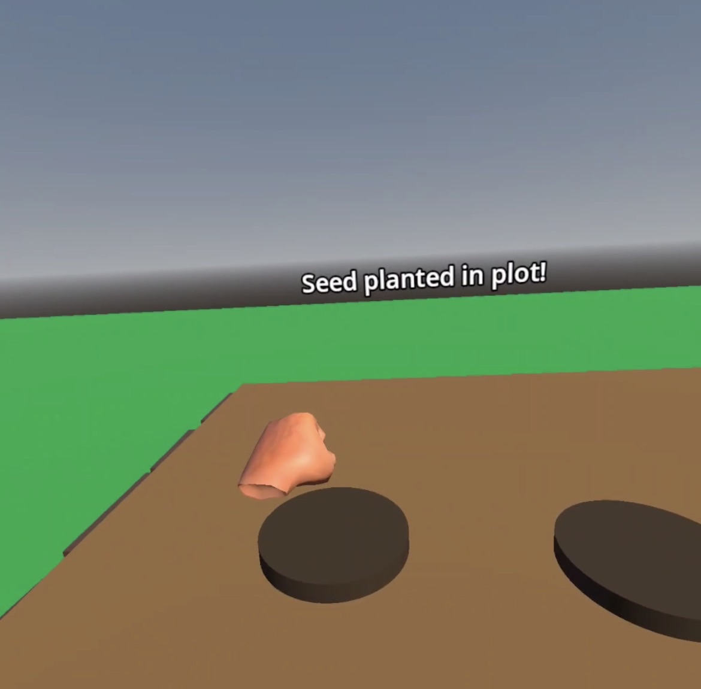
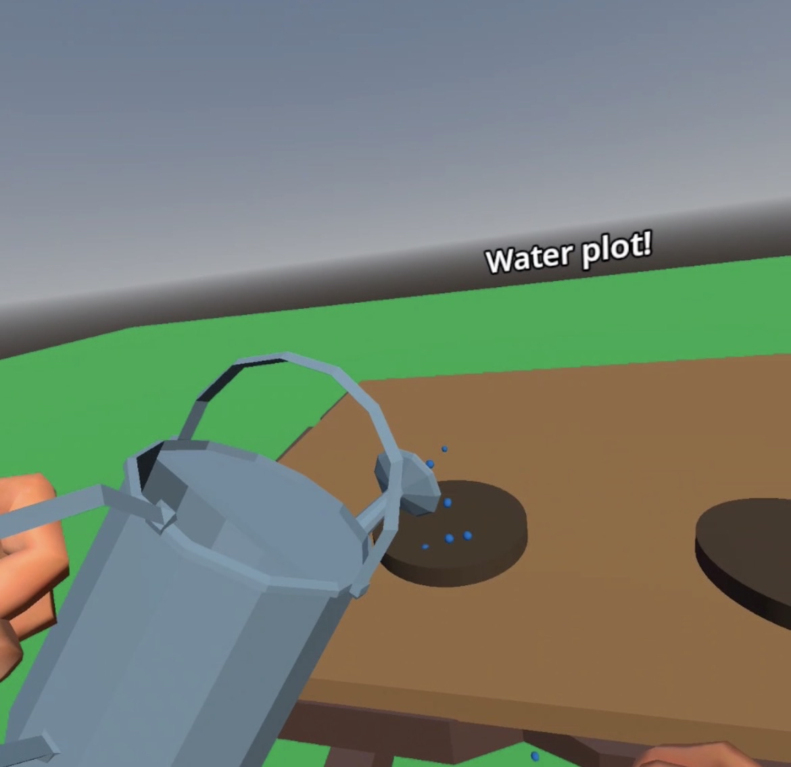
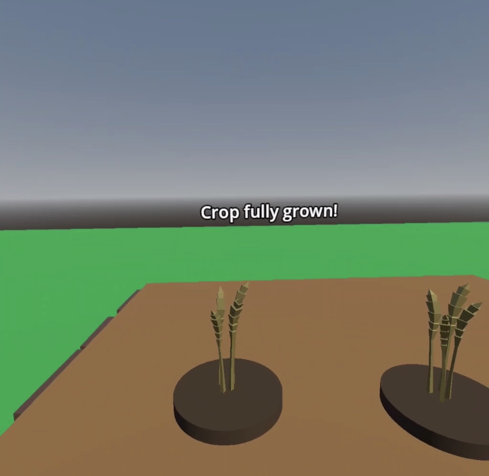
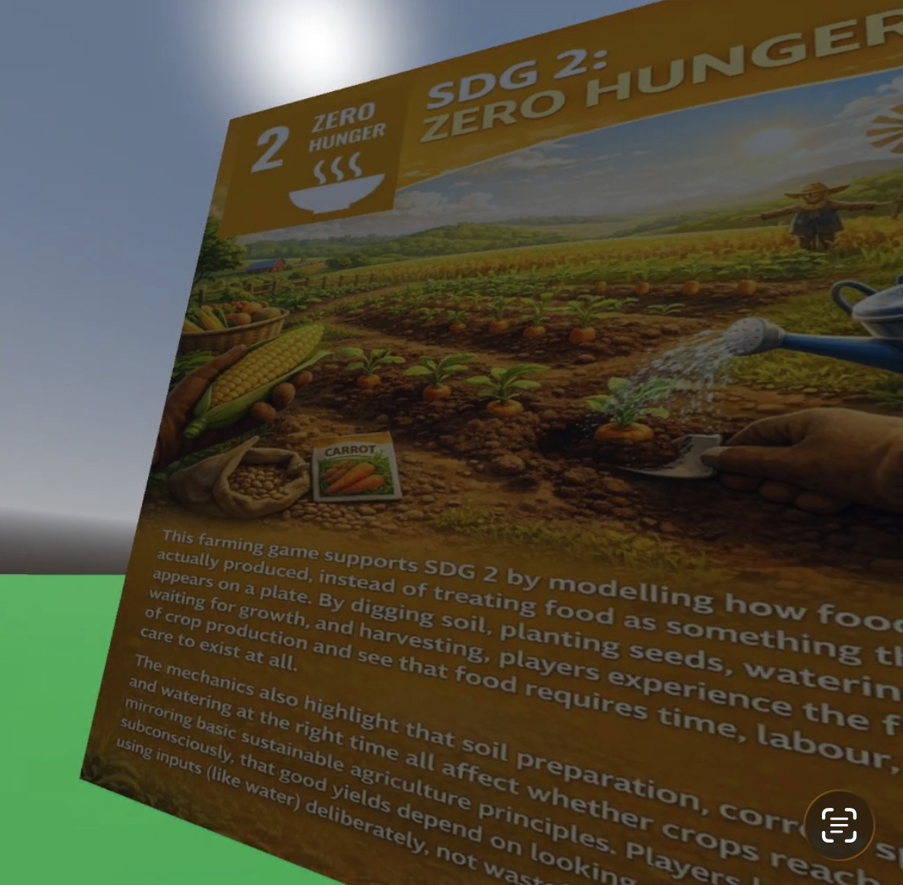

# XRP-Assignment
| **Name**     | **Student Number** |
| ----------- | ----------- |
| Karl Negrillo      | C22386123       |

# Title: Virtual Farm Planting XR Proposal

## Project Idea
This project is an interactive, **standalone** XR experience set on a virtual farm where users guide crops from seed to harvest. The user digs a plot in the soil, selects a seed, plants it, covers it up, and waters it using hand tracking interactions. The crop then grows rapidly via animation sequence. Once mature, the user harvests the crop and recieves educational informatiion about its nutritional and environmental benefits. The project is designed to be highly accessible and engaging, providing users with hands-on learning about sustainable food production.

## Which SDG(s) your project addresses and Why?
My project will experience and focus on SDG 2: Zero Hunger. The experience teaches sustainable agriculture by guiding users through planting, watering, growth, and harvesting, showing how efficient water use, crop choice, and soil care support reliable food supplies. Each stage in the planting process is linked to real-world agriculture principles, highlighting how smart farming and food choices can have a global impact. 

## Key Features and Interactions
These are the key features and interations that my assignment will have
- Immersive Farm Environment where users move through the crop-growing cycle step-by-step
- Digging soil, picking seeds, planting, covering, watering, and harvesting, all through simple and accessible XR gestures (Like picking up, tilting, etc)
- Animated, fast-forwarded plant growth and crop maturity to reinforce plant life cycles
- Educational popups/dashboards to provide facts after harvesting
- Spatial Audio for digging, watering, and environmental sounds

## XR Technologies Utilized
- Hand Tracking for all major interactions (dig, plant, water, harvest)
- 3D user interface for selecting seeds and displaying crop data
- Spatial audio feedback throughout the experience

## Sample Design for Assignment


# VirtualFarmXR: SDG 12
Name: Karl Negrillo  
Student Number: C22386123  
Github: Kubzz00  
Assisgnment Repo: [XRP Assignment Repo](https://github.com/Kubzz00/XRP-Assignment)

# Video
[Video](https://www.youtube.com/shorts/u_dq7EP3ceo)

The video shows the player using hand tracking in VR to dig a plot, plant a seed, water it and then harvest the wheat. The SDG‑related information is shown inside the world as part of the environment rather than as a normal flat UI popup.

# Screenshots








# Description of Project
This project is a small VR farm experience built in Godot that focuses on Sustainable Development Goal 2 (Zero Hunger). The player can dig soil, plant a seed, water the plot and eventually harvest wheat. The idea is to show that food doesn’t just appear instantly, and that the different steps in the process all matter.

The project uses hand tracking instead of traditional controllers, so the interaction feels more natural. SDG information is presented inside the 3D world, so the learning part is integrated into the environment instead of being a separate menu.

# Instruction of Use
1. Launch the project in VR (OpenXR) with hand tracking enabled.
2. Look at table and Status in front of you
3. Either grab the shovel on the left or use your hands, bring towards the soil on top of the table and a plot will spawn
4. On the left, there is a button to spawn a seed, grab the seed and put it in the plot
5. Status Message in front show to water plot, grab water can by handle and tilt at plot
6. Put away water can, wait till crop grows
7. Then on the plot, you will see a wheat.
8. Turn around and theres a SDG Panel

If something doesn’t respond, make sure the VR runtime is using hands (not controllers) and that the headset has a clear view of your hands.

# How it works
The world is made up of simple Node3D scenes for the farm environment and plots. Each plot has a DigInteraction script that keeps track of its state (dug, planted, watered, grown). When the player’s hand enters the Area3D of a plot, the script plays particles, updates the 3D text label, and plays sound.

Planting and harvesting are handled by checking for collisions with seed and wheat detector nodes. Timers are used to fake growth over time, so the crop doesn’t appear immediately. When the crop is ready, a wheat scene is spawned at the plot’s position.

The SDG info is displayed behind the player. The player can read what is on the panel This is meant to connect what they just did on the farm to the bigger SDG idea.

# List of Classes/Assests in the Project
| Class/asset | Source |
|-----------|-----------|
| DigInteraction.gd | Self written, with help of AI: Controls digging, planting, watering, growing |
| digSystem.gd | Self‑written. Spawns or manages the soil plot nodes. |
| planting_plot.tscn | Self-made plot scene that holds the soil mesh and DigInteraction. |
| wheats.tscn | Wheat Poly used for Farming [Poly.Pizza](https://poly.pizza/)|
| Small Table.glb | Small Table Poly used for Environment [Poly.Pizza](https://poly.pizza/)|
| watering_can.tscn | Watering Can Poly used for Farming and watering plants [Poly.Pizza](https://poly.pizza/)|
| shovel.tscn | Shovel Poly used for Farming [Poly.Pizza](https://poly.pizza/)|
| dig_particles.tscn | Self-made particle effect (GPUParticles3D) for digging feedback.|
| XR Setup with Hand Tracking | Help with YT Video [Hand Tracking](https://www.youtube.com/watch?v=HeFut3Htrcw&t=329s) |
| pickable.gd | From Godot XR Tools. Handles grabbing and harvesting wheat. |
| SDGInfo.png | Generated by AI to display on Environment [InfoPanel](ImagesSC/SDGInfo.png) |
| seedSpawner | Self Written with aid of AI. Spawns seed when button is pressed |
| Audio Files | All downloaded on this [site](https://sfxengine.com/sound-effects) |

# References
[Poly.Pizza](https://poly.pizza/)  
[Hand Tracking](https://www.youtube.com/watch?v=HeFut3Htrcw&t=329s)  
[Godot XR Tools](https://docs.godotengine.org/en/latest/tutorials/xr/introducing_xr_tools.html)  
[SFX](https://sfxengine.com/sound-effects)  
[Help from looking at past Projects on xrp25](https://github.com/skooter500/xrp25)

# Sample Code Snippets
```
func start_growth_chain() -> void:
    if is_grown:
        return  # already finished

    print("⏳ Growth timer: waiting before crop starts growing...")

    # 1st stage: wait after "Water plot!"
    await get_tree().create_timer(growth_delay_before).timeout
    update_state_label("Crop is growing")
    print("🌱 Growth timer: crop is growing...")
    _play_water_sound()

    # 2nd stage: wait until crop fully grown
    await get_tree().create_timer(growth_delay_after).timeout
    is_grown = true
    update_state_label("Crop fully grown!")
    print("🌾 Growth timer: crop fully grown")
    _play_grown_sound()

```
This function controls the “fake” growing process using two timers. It first waits a few seconds before changing the status to “Crop is growing”, then waits again before marking the crop as fully grown and playing the harvest sound. This makes the farming feel like a process instead of an instant state change.

```
func play_dig_animation():
	var plot = self
	var original_scale = plot.scale
	var tween = create_tween()
	tween.tween_property(plot, "scale", original_scale * 0.9, 0.1)
	tween.tween_property(plot, "scale", original_scale, 0.1)
	#pass
```
When the player digs, this tween quickly scales the plot down and back up to create a small “bounce” animation. It’s a simple effect, but it makes the ground feel like it reacts to the player’s hand instead of just changing text or printing to the console.

```
func plant_seed(seed_area: Area3D) -> void:
    if not can_plant:
        print("❌ Plot not ready for planting!")
        return

    is_planted = true
    can_plant = false
    is_watered = false
    is_grown = false
    spawned_wheat = null

    print("✅ SEED PLANTED!\n")
    set_plot_color(color_planted)

    update_state_label("Seed planted in plot!")
    _play_seed_sound()

    # Remove the seed from the scene
    var seed_node = seed_area.get_parent()
    if is_instance_valid(seed_node):
        seed_node.queue_free()
        print("🗑️ Seed removed from scene")

    seed_planted.emit()

    # 1 second after planting → tell player to water
    await get_tree().create_timer(1.0).timeout
    update_state_label("Water plot!")

    # Start growth timer system
    start_growth_chain()

```
This function handles everything that happens when a seed enters the plot: it updates all the state flags, removes the physical seed object, plays a sound, and then uses a short timer before telling the player to water the plot. Finally it calls start_growth_chain() to begin the timed growth logic.

```
func spawn_dig_particles():
    if not particle_scene:
        particle_scene = load("res://Scenes/dig_particles.tscn")

    if not particle_scene:
        return

    var particles = particle_scene.instantiate()
    var scene_root = get_tree().root.get_child(get_tree().root.get_child_count() - 1)
    scene_root.add_child(particles)

    var plot = self
    particles.global_position = plot.global_position + Vector3(0, 0.1, 0)
    particles.emitting = true

    cleanup_particles(particles)

```
This function spawns a dirt particle effect whenever the player digs. It lazily loads the particle scene if it’s not already set, adds the particles to the main scene root, positions them just above the plot, and starts emitting. It then calls a cleanup function so the particles automatically disappear after a short time instead of staying in the scene forever.

# What I am most Proud of
I’m most proud of getting the whole plot lifecycle working from digging to harvesting. At the start it was just a single Area3D, but now each plot actually goes through dug → planted → watered → growing → fully grown → harvested, and the code keeps all those flags in sync without breaking. It took a lot of trial and error to stop weird edge‑cases, like planting twice on the same plot or harvesting before the crop had finished growing, but the logic in DigInteraction.gd finally feels stable and understandable.  

I’m also happy with how much feedback the player gets during each step. Even though the colour‑change system for the soil didn’t fully work the way I wanted, the combination of dig particles and the short status messages on the 3D label still makes it clear what state the plot is in. Adding separate sounds for digging, planting, watering and harvesting helps a lot in VR because the player isn’t always staring directly at the plot when something happens, so they can still tell what just occurred from the audio.  

Another thing I’m proud of is getting the collisions and layers to behave properly with hand tracking. Setting up the correct collision layers and masks for the hands, the plots and the seed detectors took a while, because sometimes the hand would trigger the wrong thing or nothing at all. After cleaning that up, the plot only reacts to the right colliders (like the hand area for digging and the seed detector for planting), which makes the interactions feel more reliable. It’s not perfect, but compared to where it started, it’s a big improvement.  

I’m also pleased with how I used timers and tweens to make the experience feel less “instant”. The growth system is driven by timers, so the crop takes time to move from “Water plot!” to “Crop is growing” and finally to “Crop fully grown”, instead of appearing straight away. On top of that, the tween that quickly scales the plot when it’s dug gives a small bounce effect, which makes the ground feel like it reacts to the player’s hand instead of just switching state in the background.

# Problems of Assignment
Major one: It Looks messy  

I somewhat used AI, if you see emojis on the output, that me trying to do debugging with the help of AI. I asked help for how signals worked. But most of my work, i related it back to the existing project the professor had.

One of the main problems I ran into was getting interactions to work consistently with hand tracking. Sometimes the right hand would not trigger the pickup or dig actions, even though the left hand worked in the same place. This was usually caused by the collision layers and masks not lining up, or the wrong Area3D being used for the hand detector. I spent a lot of time changing settings, restarting the scene and printing debug messages just to figure out which objects were actually colliding.  

Another issue was trying to get the soil colour to change reliably for each state (dug, planted, etc.). In theory the material should update, but in practice it was either inconsistent or not noticeable enough in VR. Because of this, I had to rely more on particles, sounds and the 3D text label instead of the visual change on the ground. It was a bit frustrating because changing colours sounded simple, but it didn’t behave as expected in this setup.  

I also ran into a bigger structural problem with the scenes. My original design for the project lived in one branch and used an older main.tscn, but as more things broke or stopped working, it became harder to fix without making a mess. In the end I decided to create a new main.tscn called farm_experience_main.tscn and a slightly different layout, basically starting fresh while keeping the working scripts. That meant I had to re‑hook a lot of nodes, actions and interactions, and it took extra time, but it was the only way to get a version that was stable enough to demo and complete the assignment.  

I shouldve added more assets to the environment as it looks really plain but I was too focused to completing the assignment rather having it look nice.

# What I learned
- How to use assets and work with them in the project
- How collision works with layer and mask
- I also got more comfortable using timers and tweens to control the feel of the experience, not just the logic. The growth chain uses timers to create pauses between each stage, which makes the crop feel like it actually takes time to grow instead of just popping into existence. On top of that, using a tween to squash and stretch the plot slightly when it is dug gave me a better understanding of how small animations can make interactions feel more responsive, even if the underlying models are simple.
- Finally, I learned that scene organisation matters a lot once a project grows past a basic prototype. I had an older design in a different branch and an original main.tscn that slowly became harder to keep working. Creating a new farm_experience_main.tscn and rebuilding the layout felt like a setback at first, but it taught me when it’s better to start a clean scene and re‑wire things properly instead of trying to patch a messy one forever.